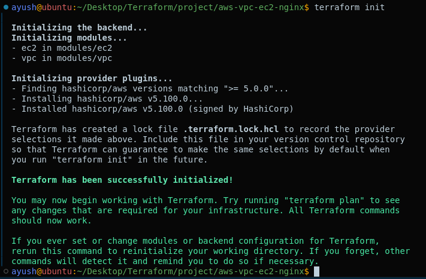
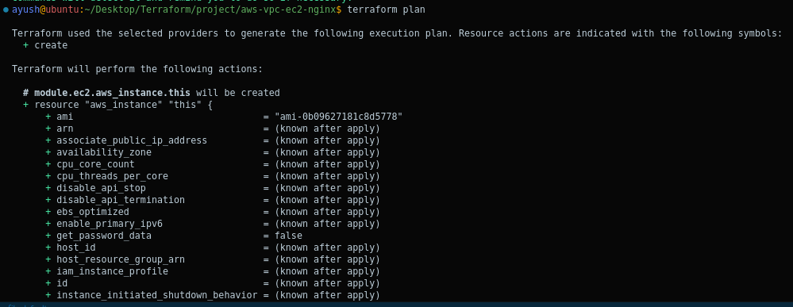
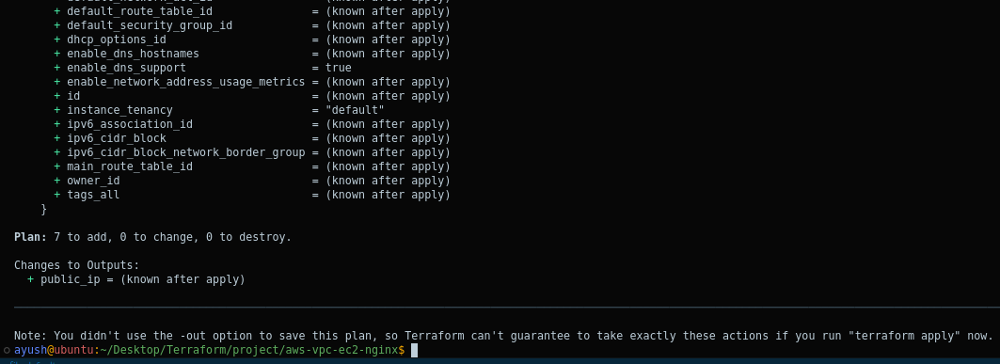
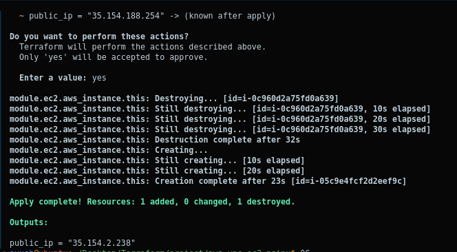
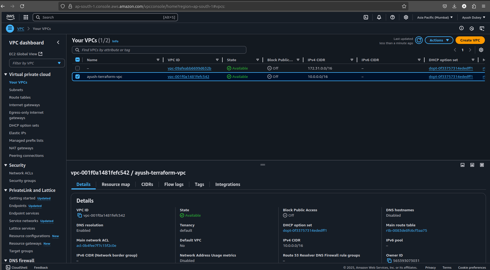
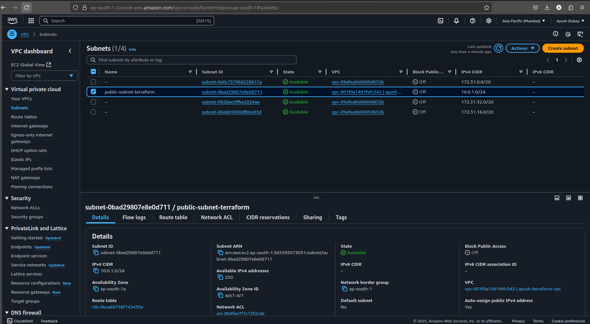
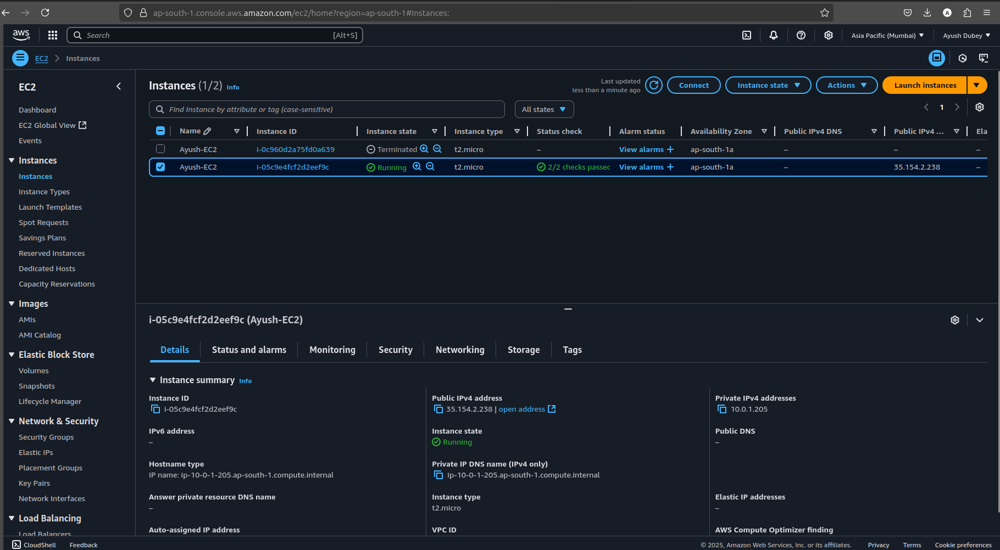
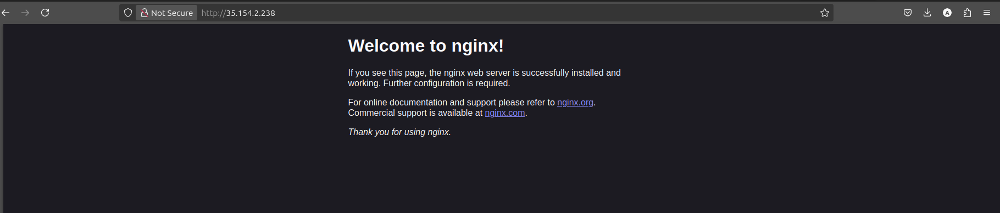
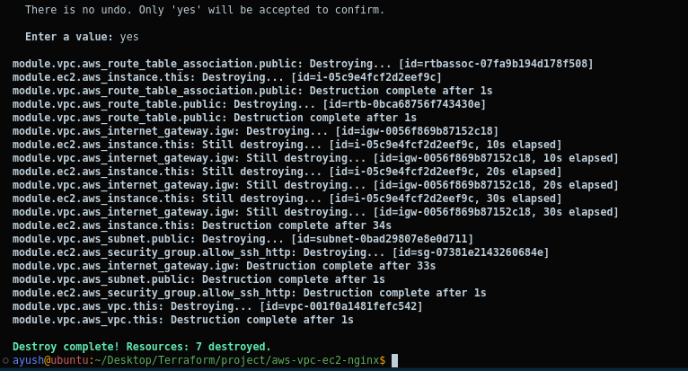

# AWS Infrastructure Automation using Terraform

## 🚀 Project Overview

This project automates the deployment of AWS infrastructure using Terraform, including:

- Custom VPC creation
- Public Subnet provisioning
- Internet Gateway and Route Table setup
- Security Group configuration (SSH + HTTP access)
- EC2 instance deployment with automated NGINX web server installation via User Data
- Modularized reusable Terraform code structure
- Parameterized variables and outputs for flexibility

## 🗺 Architecture Diagram

Internet ➔ Internet Gateway ➔ Public Subnet ➔ EC2 (NGINX) ➔ Security Groups

## 🧰 Technologies Used

- AWS (EC2, VPC, Subnet, Security Groups, IGW, Route Table)
- Terraform (Infrastructure as Code)
- NGINX (Web Server)
- Linux (Amazon Linux 2023)
- GitHub (Version Control)

## 📸 Screenshots

### Terraform Init



### Terraform Plan




### Terraform Apply



### AWS VPC Console



### AWS Subnet Console



### AWS EC2 Console



### NGINX Web Page (Browser Output)



### Terraform Destroy



## ⚙ How to Run This Project

1. Clone the repository.
2. Configure your AWS CLI credentials.
3. Create an AWS Key Pair for SSH access.
4. Edit `terraform.tfvars` with your key name.
5. Initialize Terraform:

```bash
terraform init
